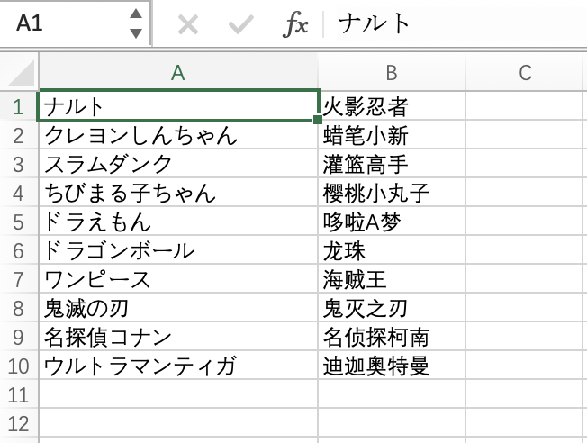

# トウキ合戦ジェネレーター

Quizizz/Kahoot! の問題ファイル（Excel）を作成するプログラムです。

[ダウンロード](https://github.com/liyi1472/toukigassen-generator/releases)

## 技術情報

1. 開発言語：**python3**

2. ライブラリー：

   `エクセル処理` **openpyxl**

   `データベース` **sqlite3** (python3に内蔵されていた)

## 事前準備

1. **Windowsの場合は、事前準備不要です。**

   > 開発者なら、[この記事](https://www.python.jp/install/windows/install.html)を参考にして、Python 3.x をインストールしてください。
   >
   > PowerShellで下記のコマンドを手入力して、エンターキーを押して実行してください。
   >
   > ```shell
   > pip install openpyxl
   > ```

2. **macOSの場合は**、[この記事](https://www.python.jp/install/macos/install_python.html)を参考にして、Python 3.x をインストールしてください。

   ターミナルに下記のコマンドを手入力して、エンターキーを押して実行してください。

   ```shell
   pip install openpyxl
   ```

## 利用方法

1. **input/** フォルダの下に、"**quizizz.xlsx**" または "**kahoot.xlsx**" の入力ファイルを入れておいてください。

   入力ファイルのフォーマットに関しては、**A 列と B 列が必須**です。

   A 列には単語を書きしましょう。B 列には外国語の意味を書きしましょう。

   （変換後、A 列の内容は問題文になり、B 列の内容は正解を含む 4 個の選択肢になる）

   　 

2. **Windows の場合は、main.exe** をダブルクリックしてください。

   > 開発者なら、Run-Win.bat も利用できます。

   **macOS の場合は、Run-Mac.command** をダブルクリックしてください。

3. 実行が完了したら、**output/** フォルダの下に、入力ファイルと同じ名前のファイルが生成されます。

   このファイルを Quizizz/Kahoot! にアップロードして、ゲームを楽しみましょう！

## 参考記事

1. [openpyxl による Excelファイル操作方法のまとめ](https://gammasoft.jp/support/how-to-use-openpyxl-for-excel-file/) | GAMMASOFT
2. [python3でsqlite3の操作。作成や読み出しなどの基礎。](https://qiita.com/saira/items/e08c8849cea6c3b5eb0c)| saira
3. [How can I add the sqlite3 module to Python?](https://stackoverflow.com/questions/19530974/how-can-i-add-the-sqlite3-module-to-python) | falsetru

